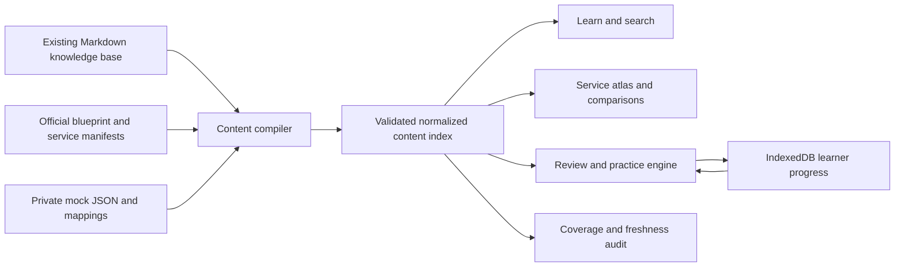

# AIP-C01 Revision Web Tool Development Plan

Status: Research complete; ready for implementation  
Certification: AWS Certified Generative AI Developer – Professional  
Exam code: AIP-C01  
Research and blueprint verification date: 2026-07-23  
Proposed product name: AIP-C01 Revision Lab

## 1. Objective

Build a local-first web application that turns the existing AIP-C01 Markdown knowledge system into an active revision tool.

The tool must:

- Cover the complete declared AWS blueprint and current in-scope service list.
- Make every official skill, service, topic, practice item, lab, and source traceable.
- Clearly label high-, medium-, and lower-priority knowledge.
- Teach service selection and tradeoffs instead of encouraging definition memorization.
- Use retrieval practice, spacing, corrective feedback, mixed scenarios, and confidence calibration.
- Measure coverage, retention, application, and readiness separately.
- Remain accurate as AWS names, APIs, model support, Regions, and exam scope change.

The existing [knowledge base](knowledge-base/README.md) remains the canonical source material. The web application is a structured learning and progress layer over it.

## 2. Important limit on the “99%” requirement

AWS explicitly states that both the exam content outline and in-scope service list are non-exhaustive. The service list is also subject to change. Therefore, no tool can honestly prove that it covers 99% of unseen exam questions.

The defensible requirement is:

> The tool must cover at least 99% of a versioned, auditable scope and must cover 100% of every mandatory official scope item.

### Auditable scope

| Scope layer | Current inventory | Required release coverage |
|---|---:|---:|
| Official domains | 5 | 5/5 |
| Official tasks | 20 | 20/20 |
| Official skills | 98 | 98/98 |
| Official technology/concept categories | 20 | 20/20 |
| Official in-scope service or feature entries | 106 across 13 categories | 106/106 |
| Local mock questions | 150 | 150/150 traceable |
| Canonical concept guides | 12 | 12/12 |
| Hands-on labs | 6 | 6/6 |
| Existing active-recall prompts | 85 | 85/85 |
| Existing architecture scenarios | 20 | 20/20 |

The 106 entries are not necessarily 106 independent services. AWS separately lists some service features, such as DynamoDB Streams, Bedrock Knowledge Bases, and S3 Lifecycle policies. The data model must distinguish a service family, service, and feature.

### Release coverage gates

The application may show a “99%+ auditable coverage” badge only when all of these pass:

1. Official domain, task, skill, concept, and service coverage is **100%**.
2. At least **99% of required content fields** are populated across all published records.
3. At least **99% of official skills** have both a recall item and an application scenario.
4. Every high-priority skill and service has implementation, comparison, security, cost, failure, and troubleshooting coverage.
5. At least **99% of published factual records** have an official source and verification date.
6. All 150 local mock questions map to at least one skill and canonical topic.
7. No critical source is beyond its freshness limit.
8. The build contains no broken content relationships, invalid answers, or missing internal links.

The implementation must generate a machine-readable `coverage-report.json` and fail the build when a mandatory gate is not met.

## 3. Verified exam model

| Domain | Weight | Tasks | Skills | Approximate share of 65 scored questions |
|---|---:|---:|---:|---:|
| D1: FM integration, data management, and compliance | 31% | 6 | 28 | 20 |
| D2: Implementation and integration | 26% | 5 | 25 | 17 |
| D3: AI safety, security, and governance | 20% | 4 | 15 | 13 |
| D4: Operational efficiency and optimization | 12% | 3 | 16 | 8 |
| D5: Testing, validation, and troubleshooting | 11% | 2 | 14 | 7 |
| **Total** | **100%** | **20** | **98** | **65** |

The approximate question counts are planning estimates, not values published by AWS.

The exam behavior to reproduce is:

- 75 questions in 180 minutes.
- 65 scored questions and 10 unidentified unscored questions.
- Multiple-choice and multiple-response items.
- Multiple-response scoring is all-or-nothing.
- Unanswered questions are incorrect.
- There is no penalty for guessing.
- AWS reports a scaled score from 100–1,000, with 750 as the passing standard.
- Scoring is compensatory across domains.

The tool must not convert a raw practice percentage into a claimed AWS scaled score.

## 4. Content hierarchy

Use one traceable hierarchy:

```text
Certification
  → Domain
    → Task
      → Skill
        → Canonical topic
          → Service or feature
          → Decision/comparison
          → Recall item
          → Scenario question
          → Lab
          → Official source
```

Domain pages are navigation and summary objects. Canonical topic records own the detailed knowledge so content is not duplicated across domain screens.

### Topic families to organize

#### Domain 1 — 31%

1. Requirements analysis, constraints, PoCs, business value, and Well-Architected design.
2. FM selection, benchmarking, model limits, dynamic routing, resilience, and customization lifecycle.
3. Data quality, model-specific input formats, text/image/audio/tabular processing, and multimodal pipelines.
4. Vector stores, metadata, scaling, connectors, synchronization, and data freshness.
5. Chunking, embeddings, semantic/lexical/hybrid search, reranking, and query transformation.
6. Prompt engineering, context management, Prompt Management, governance, QA, and Prompt Flows.

#### Domain 2 — 26%

1. Agent loops, memory, state, stopping conditions, tool use, multi-agent coordination, and human review.
2. MCP, Strands Agents, Bedrock Agents, AgentCore, Lambda tools, and container-hosted tools.
3. Bedrock inference modes, SageMaker deployment, large-model loading, autoscaling, and model cascading.
4. API, webhook, event-driven, asynchronous, hybrid, and enterprise integration patterns.
5. Bedrock Runtime, Bedrock Mantle, Converse, InvokeModel, streaming, retries, throttling, and routing.
6. CI/CD, configuration, gateway, frontend, business-system integration, and developer tooling.

#### Domain 3 — 20%

1. Harmful-input and harmful-output controls.
2. Hallucination reduction, deterministic validation, structured output, and defense in depth.
3. Prompt injection, jailbreaks, adversarial testing, and safe tool execution.
4. IAM, VPC endpoints, data permissions, encryption, privacy, masking, retention, and PII controls.
5. Governance, source lineage, audit evidence, model cards, drift, and regulatory readiness.
6. Transparency, evidence, uncertainty, fairness, and policy compliance.

#### Domain 4 — 12%

1. Token efficiency, context budgets, model economics, routing, capacity, and batching.
2. Exact caching, prompt caching, semantic caching, and cache-safety decisions.
3. TTFT, total latency, streaming, retrieval latency, throughput, and concurrency.
4. Model parameters, resource allocation, and end-to-end workflow optimization.
5. Logs, metrics, traces, model invocation logging, tool monitoring, vector operations, and business KPIs.

#### Domain 5 — 11%

1. Output-quality dimensions, model comparison, user feedback, and release gates.
2. RAG evaluation, agent evaluation, LLM-as-a-judge, human evaluation, and reporting.
3. Synthetic validation, canaries, regression, hallucination, and semantic drift.
4. Context overflow, API/payload errors, prompt failures, retrieval failures, and evidence-first diagnosis.

### Canonical source map

| Canonical content | Primary file | Initial depth |
|---|---|---|
| Bedrock model selection and runtime APIs | [Model selection](knowledge-base/concepts/bedrock-model-selection-and-runtime-apis.md) | High |
| RAG, Knowledge Bases, and vector search | [RAG](knowledge-base/concepts/rag-knowledge-bases-vector-search.md) | High |
| Prompt engineering, management, and Flows | [Prompts](knowledge-base/concepts/prompt-engineering-management-and-flows.md) | High |
| Agents, tools, MCP, and AgentCore | [Agents](knowledge-base/concepts/agents-tools-mcp-and-agentcore.md) | High |
| Data quality and multimodal processing | [Data processing](knowledge-base/concepts/data-quality-and-multimodal-processing.md) | Medium |
| Safety, privacy, and Responsible AI | [Safety](knowledge-base/concepts/safety-privacy-and-responsible-ai.md) | High |
| Security, networking, and access control | [Security](knowledge-base/concepts/security-networking-and-access-control.md) | High |
| Evaluation, testing, and quality gates | [Evaluation](knowledge-base/concepts/evaluation-testing-and-quality-gates.md) | High |
| Cost, latency, throughput, and caching | [Efficiency](knowledge-base/concepts/cost-latency-throughput-and-caching.md) | High |
| Observability and troubleshooting | [Observability](knowledge-base/concepts/observability-and-troubleshooting.md) | High |
| Enterprise integration and CI/CD | [Enterprise integration](knowledge-base/concepts/enterprise-integration-and-cicd.md) | High |
| SageMaker custom-model deployment | [SageMaker deployment](knowledge-base/concepts/sagemaker-custom-model-deployment.md) | Medium |

Supporting content comes from the six [reference guides](knowledge-base/README.md#fast-reference), four [practice guides](knowledge-base/README.md#practice-and-active-recall), and six [labs](knowledge-base/README.md#hands-on-validation).

## 5. Importance model

AWS publishes domain weights. It does not publish per-service question probability, and the order of its technology list does not indicate importance.

The tool must show two separate labels:

- **Content importance:** derived from the official blueprint and architecture decision depth.
- **Personal priority:** derived from the learner’s delayed accuracy, confidence, mistakes, and due reviews.

Do not label a weak learner result as evidence that a service is more likely to appear on the exam.

### Initial content-importance score

Score each service or feature from 3–10:

| Factor | Score |
|---|---:|
| Named in at least three skills or multiple domains | 4 |
| Named in one or two official skills | 3 |
| Appendix-only evidence | 1 |
| Central to inference, RAG, agents, safety, or evaluation | 3 |
| Recurring security, integration, deployment, or observability role | 2 |
| Narrow supporting role | 1 |
| Requires configuration, comparison, troubleshooting, or optimization | 2 |
| Recognition is normally sufficient | 1 |
| Volatile name/API/model/Region behavior requiring active recheck | +1 |

Labels:

- **High, 8–10:** implementation knowledge, comparisons, configuration, troubleshooting, and hands-on validation.
- **Medium, 5–7:** purpose, integrations, security boundary, failure modes, and when/when-not decisions.
- **Lower/awareness, 3–4:** recognition, principal use case, strongest distractor, and escalation trigger.

“Lower” means lower required depth, not safe to ignore.

### Current provisional service priorities

These bootstrap labels come from the verified local service decision catalog. The implementation must retain the score and reason, not only the label.

#### High — implementation depth (26)

- AWS AppConfig
- AWS CloudTrail
- AWS CodePipeline
- AWS IAM
- AWS Lambda
- AWS PrivateLink
- AWS SDKs and tools
- AWS Step Functions
- AWS X-Ray
- Amazon API Gateway
- Amazon Bedrock, including Guardrails and runtime capabilities
- Amazon CloudWatch
- Amazon DynamoDB
- Amazon EventBridge
- Amazon OpenSearch Service
- Amazon S3
- Amazon SQS
- Amazon SageMaker AI
- Amazon Titan
- Amazon VPC
- Bedrock AgentCore
- Bedrock Knowledge Bases
- Bedrock Prompt Flows / Flows
- Bedrock Prompt Management
- CloudWatch Logs
- SageMaker Model Registry

#### Medium — architectural decision depth (41)

- AWS Amplify
- AWS Auto Scaling
- AWS CDK
- AWS CloudFormation
- AWS CodeBuild
- AWS CodeDeploy
- AWS Cost Anomaly Detection
- AWS Cost Explorer
- AWS Fargate
- AWS Glue
- AWS KMS
- AWS Outposts
- AWS Secrets Manager
- AWS WAF
- AWS Well-Architected Tool
- Amazon AppFlow
- Amazon Athena
- Amazon Aurora
- Amazon CloudFront
- Amazon Cognito
- Amazon Comprehend
- Amazon EBS
- Amazon ECR
- Amazon ECS
- Amazon ElastiCache
- Amazon Macie
- Amazon Q Business
- Amazon Q Developer
- Amazon Quick Sight
- Amazon RDS
- Amazon SNS
- Amazon Textract
- Amazon Transcribe
- CloudWatch Synthetics
- IAM Access Analyzer
- IAM Identity Center
- S3 Lifecycle policies
- SageMaker Data Wrangler
- SageMaker JumpStart
- SageMaker Model Monitor
- SageMaker Processing

#### Lower — recognition depth (39)

- AWS App Runner
- AWS AppSync
- AWS CLI
- AWS Chatbot, currently named Amazon Q Developer in chat applications
- AWS CodeArtifact
- AWS DataSync
- AWS Encryption SDK
- AWS Global Accelerator
- AWS Service Catalog
- AWS Systems Manager
- AWS Transfer Family
- AWS Wavelength
- Amazon Augmented AI (A2I)
- Amazon Connect
- Amazon DocumentDB
- Amazon EC2
- Amazon EFS
- Amazon EKS
- Amazon EMR
- Amazon Kendra
- Amazon Kinesis
- Amazon Lex
- Amazon MSK
- Amazon Managed Grafana
- Amazon Neptune
- Amazon Q Business Apps
- Amazon Quick
- Amazon Rekognition
- Amazon Route 53
- DynamoDB Streams
- Elastic Load Balancing
- Kiro
- Lambda@Edge
- S3 Cross-Region Replication
- S3 Intelligent-Tiering
- SageMaker Clarify
- SageMaker Ground Truth
- SageMaker Neo
- SageMaker Unified Studio

### High-priority topic families

Topic priority is broader than individual service priority.

| Priority | Topic family | Reason |
|---|---|---|
| Critical | RAG, Knowledge Bases, embeddings, vector/hybrid search, reranking | Large D1 skill cluster and frequent architecture decisions |
| Critical | Bedrock model selection, endpoints, APIs, inference modes, and resilience | Core FM integration and implementation contract |
| Critical | Agents, tools, MCP, Step Functions, AgentCore, memory, and human review | Major D2 implementation area with many failure and safety boundaries |
| Critical | Prompt engineering, management, governance, and Flows | Directly tested design and lifecycle skill |
| Critical | Safety, Guardrails, prompt attacks, IAM, privacy, and data access | Entire D3 plus cross-domain requirements |
| Critical | Enterprise APIs, queues/events, retries, idempotency, and integration | Repeated D2 architecture selection |
| Critical | Evaluation, observability, release gates, and troubleshooting | Entire D5 and much of D4 |
| Important | Cost, latency, token throughput, caching, routing, and capacity | Full D4 optimization path and frequent tradeoffs |
| Important | Data validation and multimodal processing | Explicit D1 pipeline skills |
| Important | SageMaker custom/open-weight model deployment | Required when Bedrock-managed options do not fit |
| Important | Responsible AI, governance, lineage, and model cards | D3 compliance and fairness outcomes |
| Important | CI/CD, IaC, configuration, canary, and rollback | Production implementation and governance |
| Supporting | Narrow edge, migration, visualization, contact-center, and specialist services | In scope, but normally recognition or explicit-requirement choices |

Local mock frequency may help find practice gaps, but it must never be presented as official exam probability.

## 6. Revision mechanics supported by research

| Priority | Method | Product behavior |
|---|---|---|
| Critical | Retrieval practice | Require an answer before revealing notes. Start with free recall or architecture choice before recognition questions. |
| Critical | Spaced practice | Maintain a daily due queue. Bootstrap new items, then adapt intervals from review performance. |
| Critical | Corrective feedback | Explain the governing rule, correct answer, every distractor, and official AWS source. Retest later. |
| Critical | Exam-format practice | Provide short drills and 75-question, 180-minute simulations with all-or-nothing multiple-response scoring. |
| High | Interleaving | Mix confusable services and patterns after initial instruction rather than drilling one category continuously. |
| High | Scenario transfer | Test the same rule in changed industries, constraints, and architectures. |
| High | Error-driven review | Automatically record wrong answers, misconceptions, sources, and next review. Prioritize high-confidence errors. |
| Medium | Mastery tracking | Track delayed recall and novel application by official skill; do not treat a page view or immediate retry as mastery. |
| Medium | Confidence calibration | Ask for confidence and report accuracy by confidence band. Confidence informs review but never replaces accuracy. |
| Supporting | Reading, highlighting, and streaks | Use for orientation and motivation only; they are not primary proof of learning. |

There is strong evidence for retrieval, spacing, and corrective feedback. There is no universal scientifically correct spacing interval or mastery threshold. Defaults are product heuristics and must be adjustable.

### Default learning loop

1. Attempt a short recall prompt without notes.
2. Identify the scenario’s workload and hard constraints.
3. Choose an answer.
4. Record confidence.
5. Reveal source-backed feedback.
6. Explain why the strongest distractor fails.
7. Retry the rule without answer choices.
8. Schedule a delayed review.
9. Apply the rule in a changed scenario.

### Mastery states

- Unseen.
- Introduced.
- Recalled once.
- Retained on separated reviews.
- Applied correctly in a novel scenario.
- Mastered, with future spaced checks still required.

A practical initial “mastered” rule is:

- Two successful delayed reviews.
- At least one correct novel scenario.
- No unresolved high-confidence error.
- Required lab evidence completed when the topic is high priority.

This is an internal readiness rule, not an AWS scoring rule.

### Default daily queue

Use a tunable starting mix:

- 60% items currently due through spaced review.
- 25% weak skills, repeated misconceptions, and high-confidence errors.
- 15% new content.

Use an established scheduler such as FSRS through its maintained TypeScript implementation. Start with sensible default parameters and optimize only after sufficient personal review history exists.

## 7. Practice inventory and expansion plan

### Existing usable assets

- 150 private local mock questions:
  - 125 single-answer questions.
  - 25 two-answer multiple-response questions.
  - Per-option explanations and official references.
- 85 active-recall prompts with answer keys.
- 20 architecture scenario drills with answer keys.
- Six hands-on labs.
- A service decision catalog, API cheat sheet, architecture decisions, metrics/errors reference, glossary, and official source registry.

### Required first-release practice coverage

1. Every official skill has at least:
   - One free-recall prompt.
   - One service/architecture selection scenario.
   - One official source.
2. Every high-priority skill also has:
   - At least one troubleshooting or failure-mode scenario.
   - At least one confusable-alternative question.
   - A lab, architecture explanation, or API/configuration exercise.
3. Every service or feature has:
   - A “use when” check.
   - A “do not use when” or main-distractor check.
4. Every question has:
   - Skill, topic, service, domain, difficulty, and version tags.
   - Correct-answer rationale.
   - Rationale for every distractor.
   - At least one current official source.
   - A `verified_at` date.

### Original question-bank target

Create approximately 450 original, source-backed practice items:

- 200 free-recall or short-answer items.
- 180 single- or multiple-response scenarios.
- 40 service-comparison drills.
- 30 troubleshooting drills.

The 150 existing Udemy-derived questions can be imported for private personal use. They must not be included in a public deployment unless redistribution rights are confirmed. A public build must use original documentation-derived questions and must never use exam dumps.

### Mandatory comparison drills

1. Bedrock versus SageMaker AI.
2. `bedrock-runtime` versus `bedrock-mantle`.
3. Converse versus InvokeModel versus compatible APIs.
4. On-demand versus cross-Region inference versus Provisioned Throughput versus batch.
5. Managed Knowledge Bases versus customer-managed Knowledge Bases.
6. `Retrieve` versus `RetrieveAndGenerate` versus `AgenticRetrieveStream`.
7. OpenSearch versus Aurora PostgreSQL with pgvector versus managed vector storage.
8. Lexical versus vector versus hybrid retrieval versus reranking.
9. Agents versus Step Functions versus Prompt Flows.
10. Lambda versus ECS/Fargate versus AgentCore Runtime for tools.
11. SQS versus EventBridge versus SNS.
12. CloudWatch versus CloudTrail versus X-Ray.
13. Macie versus Comprehend versus Guardrails.
14. IAM Identity Center versus Cognito.
15. PrivateLink/VPC endpoints versus IAM authorization.
16. Glue Data Quality versus SageMaker Data Wrangler.
17. Prompt Management versus S3/AppConfig configuration.
18. Kendra/Q Business versus custom Bedrock RAG.
19. HTTP, REST, WebSocket, and asynchronous API patterns.
20. CodePipeline, CodeBuild, and CodeDeploy responsibilities.

## 8. Core user experience

### 8.1 Dashboard

Show:

- Due reviews today.
- Overall readiness estimate.
- Domain mastery weighted 31/26/20/12/11.
- Coverage versus mastery as different metrics.
- High-priority gaps.
- High-confidence errors.
- Upcoming stale-source reviews.
- Unseen timed-exam history.

Do not use page completion as the primary success metric.

### 8.2 Blueprint map

Allow navigation:

```text
Domain → Task → Skill → Topic → Practice → Source
```

Each official skill shows:

- Importance.
- Coverage status.
- Mastery state.
- Last review.
- Delayed accuracy.
- Related services and comparisons.
- Questions, labs, and sources.

### 8.3 Service atlas

Provide all 106 current entries with filters for:

- High, medium, or lower depth.
- Official category.
- Domain, task, and skill.
- Service, feature, or family.
- Managed/serverless, container, database, security, integration, or observability role.
- Volatile/currently changing facts.
- Personal weakness.

Every service card must answer:

1. What is it?
2. When should it be used?
3. When should it not be used?
4. What is its main exam distractor?
5. Which requirements change the answer?
6. What security boundary matters?
7. What cost, latency, or operational tradeoff matters?
8. What failure evidence should be inspected?
9. Which official skills and sources cover it?

### 8.4 Comparison trainer

Show two to four confusable choices. Require the learner to identify:

- Workload.
- Hard constraint.
- Correct service or pattern.
- Why the nearest alternative fails.

The screen must support side-by-side decision tables and changed-scenario retries.

### 8.5 Daily review

Order:

1. Due recall.
2. High-confidence errors.
3. Weak high-priority skills.
4. Mixed scenario questions.
5. New content.

Review controls:

- Again.
- Hard.
- Good.
- Easy.
- “I guessed” flag.
- Confidence level.
- Error classification.

### 8.6 Practice modes

- Topic drill.
- Service drill.
- Comparison drill.
- Weak-area drill.
- Mixed interleaved drill.
- Troubleshooting drill.
- Multiple-response drill.
- Ten-minute quick session.
- Domain-weighted exam simulation.
- Full 75-question, 180-minute simulation.

### 8.7 Error notebook

Capture automatically:

- Question ID.
- Chosen answer.
- Confidence.
- Miss category.
- Hidden constraint.
- Correct rule.
- Strongest distractor failure.
- Canonical topic and source.
- Next review date.
- A changed follow-up scenario.

Miss categories:

- Knowledge gap.
- Misread constraint.
- Service confusion.
- API or payload confusion.
- Security omission.
- Cost/latency tradeoff error.
- Troubleshooting evidence error.
- Overengineering.
- Outdated or questionable source.

### 8.8 Labs

Track evidence for the six existing labs:

1. Bedrock API and streaming.
2. RAG and Knowledge Bases.
3. Guardrails and private access.
4. Agent tools and Step Functions.
5. Model, RAG, and agent evaluation.
6. Observability, cost, and performance.

Evidence can include:

- Checklist completion.
- Architecture explanation.
- Commands or code exercised.
- Expected versus actual result.
- Failure injected and diagnosed.
- Cleanup confirmation.

### 8.9 Sources and freshness

Show:

- Official source title and URL.
- Claim, service, and skill mappings.
- Last verification date.
- Expected recheck interval.
- Current/stale/changed status.
- Replacement or alias history.

## 9. Information architecture and routes

```text
/                         Dashboard
/blueprint                Domain/task/skill coverage map
/topics                   Topic index
/topics/:topicId          Canonical learning and practice page
/services                 All-service atlas
/services/:serviceId      Service/feature decision card
/compare                  Confusable-service trainer
/review                   Daily spaced-review queue
/practice                 Practice-mode selector
/practice/session/:id     Active practice session
/mocks                    Timed simulations and results
/labs                     Lab index and evidence
/errors                   Error notebook
/progress                 Domain, skill, retention, and confidence reports
/sources                  Source and freshness registry
/settings                 Retention, data export/import, and privacy
```

The interface should be keyboard-first, responsive, screen-reader friendly, and must not use color as the only priority or correctness indicator.

## 10. Content pipeline

The current knowledge is rich but not fully machine-readable. Stable IDs and normalized relationships must be implemented before the main UI.



### Proposed project structure

```text
revision-web/
├── src/
│   ├── app/
│   ├── components/
│   ├── features/
│   │   ├── blueprint/
│   │   ├── services/
│   │   ├── review/
│   │   ├── practice/
│   │   ├── labs/
│   │   ├── errors/
│   │   └── progress/
│   ├── content/
│   ├── storage/
│   └── workers/
├── content/
│   ├── blueprint.json
│   ├── concepts.json
│   ├── services.json
│   ├── comparisons.json
│   ├── questions/
│   ├── labs.json
│   └── sources.json
├── scripts/
│   ├── compile-content.ts
│   ├── validate-coverage.ts
│   ├── check-sources.ts
│   └── build-private-content.ts
├── tests/
└── public/
```

The compiler should read the existing `knowledge-base/` files rather than create a second uncontrolled prose copy.

### Current structured-data gaps

1. No stable IDs connect domains, tasks, skills, topics, services, questions, labs, and sources.
2. Recall questions, scenarios, traps, and service tables are not atomic records.
3. Mock questions, explanations, and mappings must be joined by exam and question number.
4. Importance, prerequisites, difficulty, estimated time, and mastery rules are not stored.
5. Progress events, confidence, intervals, due dates, and error classes do not yet exist.
6. Service records lack machine-readable confusion pairs and exact skill relationships.
7. Source freshness is prose rather than per-record metadata.
8. Some service labels have both exam names and newer product names.
9. The source question field `was_selected` is attempt history and must not remain in canonical question data.
10. Private third-party mock content needs a separate build boundary.

## 11. Core data model

```ts
type Importance = "high" | "medium" | "awareness";
type EntityType = "service-family" | "service" | "feature";

interface SourceRef {
  id: string;
  title: string;
  url: string;
  publisher: "AWS" | "research";
  verifiedAt: string;
  recheckAfterDays: number;
  status: "current" | "stale" | "changed";
}

interface SkillRecord {
  id: string;                 // Example: "1.5.4"
  domainId: string;
  taskId: string;
  title: string;
  topicIds: string[];
  serviceIds: string[];
  sourceIds: string[];
  importance: Importance;
}

interface ServiceRecord {
  id: string;
  examLabel: string;
  currentLabel: string;
  aliases: string[];
  entityType: EntityType;
  serviceFamilyId?: string;
  apiNamespace?: string;
  category: string;
  skillIds: string[];
  topicIds: string[];
  importanceScore: number;
  importance: Importance;
  importanceReason: string;
  useWhen: string[];
  avoidWhen: string[];
  confusionIds: string[];
  securityBoundary: string[];
  costLatencyOps: string[];
  failureModes: string[];
  regionConstraints: string[];
  modelConstraints: string[];
  maturity?: "GA" | "preview" | "legacy";
  effectiveFrom?: string;
  effectiveTo?: string;
  sourceIds: string[];
  verifiedAt: string;
}

interface QuestionRecord {
  id: string;
  visibility: "public-original" | "private-licensed";
  type: "recall" | "single-choice" | "multiple-response" | "scenario" | "troubleshooting";
  stem: string;
  options?: Array<{
    id: string;
    text: string;
    isCorrect: boolean;
    explanation: string;
  }>;
  answer: string;
  skillIds: string[];
  topicIds: string[];
  serviceIds: string[];
  sourceIds: string[];
  difficulty: 1 | 2 | 3 | 4 | 5;
  variantGroupId?: string;
  verifiedAt: string;
}

interface ReviewEvent {
  id: string;
  learnerId: string;
  contentId: string;
  attemptedAt: string;
  correct: boolean;
  responseTimeMs: number;
  confidence: 1 | 2 | 3 | 4;
  guessed: boolean;
  errorType?: string;
  rating: "again" | "hard" | "good" | "easy";
  nextReviewAt: string;
}
```

The final schema should use runtime validation and refuse to publish invalid content.

## 12. Technical architecture

### MVP recommendation

- Current stable React with TypeScript and Vite.
- Static progressive web application.
- Markdown parsing through the unified/remark ecosystem.
- Runtime schemas through Zod.
- Full-text client search through a compact generated index.
- IndexedDB for attempts, review history, lab evidence, and preferences.
- FSRS-compatible TypeScript scheduler for due reviews.
- Vitest for content and logic tests.
- Playwright for user-flow, offline, and accessibility checks.

This architecture keeps a personal tool private, fast, inexpensive, and usable offline.

### Optional cross-device phase

Add only if required:

- Cognito for user identity.
- API Gateway/AppSync and Lambda for synchronization.
- DynamoDB for learner state.
- S3/CloudFront or an approved hosting platform for static delivery.

Do not add a backend to the MVP only to make the architecture look more “AWS-like.”

### AI usage boundary

An LLM may help draft new question variants during authoring, but no generated question is published without:

- A human-confirmed correct answer.
- Distractor validation.
- Official AWS sources.
- Scope mapping.
- Version verification.

The learner-facing revision path should remain deterministic. An AI tutor can be considered later, with source grounding, citations, and explicit uncertainty.

## 13. Version-sensitive content

The content model must preserve exam terminology while showing current terminology:

- Amazon SageMaker is now Amazon SageMaker AI, while API namespaces still use `sagemaker`.
- AWS Chatbot is now Amazon Q Developer in chat applications, while the exam appendix still contains AWS Chatbot.
- Amazon Quick, Amazon Quick Sight, Amazon Q Business, and Q Business Apps are distinct entries.
- Bedrock Mantle and Bedrock Runtime support different APIs and feature sets.
- `RetrieveAndGenerate` cannot be used with the product named Managed Knowledge Bases.
- Eligible customized Bedrock models can use current on-demand custom-model deployments.
- Batch support varies by model, custom-model type, and Region.
- AgentCore capabilities and maturity are evolving.

### Freshness policy

| Content type | Recheck |
|---|---|
| Exam blueprint and service appendix | Weekly automated diff; manual review on change |
| Bedrock endpoints, model/API compatibility, AgentCore, model deployment | Every 30 days |
| Regions, quotas, pricing, and model support | Before each release and before production labs |
| Stable service decision boundaries | Every 90 days |
| Learning-science mechanics | Annually or when the scheduler changes |

External link health is not proof that a claim remains true. A changed page must enter a manual review queue.

## 14. Readiness model

Maintain separate metrics:

### Coverage

How much of the declared scope is represented by validated content.

### Mastery

Whether a learner can recall and apply a skill after a delay.

### Readiness

Whether recent, unseen, timed performance is consistently above the target.

### Suggested readiness calculation

Calculate skill mastery from:

- 30% delayed recall accuracy.
- 35% novel scenario accuracy.
- 15% confusable-service discrimination.
- 10% troubleshooting/application evidence.
- 5% confidence calibration.
- 5% required lab evidence.

Then weight domain mastery by 31/26/20/12/11.

This is a transparent study indicator, not an AWS score estimate.

### Exam booking gate

- At least 85% on two unseen, timed, full-length simulations.
- At least 80% in each domain.
- At least 90% across Domains 1–3 combined.
- No unresolved high-priority coverage gaps.
- No overdue high-confidence error cluster.
- Can explain why the strongest distractors are wrong.
- Can explain or reproduce the six lab architectures.

## 15. Development sequence

### Phase 0 — Content contract and coverage harness

Deliver:

- Stable ID conventions.
- Blueprint, concepts, services, sources, and relationship manifests.
- Runtime schemas.
- Markdown/JSON compiler.
- Coverage report.
- Public/private content separation.

Exit criteria:

- 98/98 skills, 106/106 service entries, and 20/20 official concept categories resolve.
- No orphan or duplicate canonical records.
- Build fails on missing mandatory coverage.

### Phase 1 — Content normalization

Deliver:

- Atomic service cards.
- Topic-to-skill mapping.
- Machine-readable recall, scenario, comparison, lab, and source records.
- Joined local mock records with their explanations and mappings.
- Initial importance scores with reasons.

Exit criteria:

- Required-field completeness is at least 99%.
- Every published fact and question has a source.
- Private mock content cannot enter the public bundle.

### Phase 2 — Core learning interface

Deliver:

- Dashboard.
- Blueprint map.
- Topic pages.
- Service atlas.
- Search.
- Comparison trainer.
- Source/freshness views.

Exit criteria:

- All 106 service/feature entries are discoverable.
- Every skill can be reached in three interactions or fewer from the blueprint.
- The application works offline after first load.

### Phase 3 — Revision engine

Deliver:

- Daily due queue.
- Spaced scheduler.
- Recall, choice, multiple-response, scenario, and troubleshooting modes.
- Confidence recording.
- Automatic error notebook.
- Personal-priority adaptation.

Exit criteria:

- Review state survives reload and offline use.
- Scheduling is deterministic and tested.
- Immediate retry never marks an item mastered.

### Phase 4 — Assessment and labs

Deliver:

- Domain-weighted practice.
- Full 75-question, 180-minute simulation.
- All-or-nothing multiple-response scoring.
- Lab evidence tracking.
- Readiness and confidence-calibration reports.

Exit criteria:

- Raw scores are never represented as AWS scaled scores.
- Tests cannot expose answers before submission.
- Reports separate first-attempt, repeated, and unseen performance.

### Phase 5 — Quality and release

Deliver:

- Accessibility audit.
- Performance and offline validation.
- Export/import of learner data.
- Content freshness checks.
- Deployment package.

Exit criteria:

- No critical accessibility failures.
- No broken links or content relationships.
- Export/import round-trip preserves review history.
- The coverage report satisfies every gate in section 2.

## 16. Test strategy

### Content tests

- All official IDs are unique and present.
- All referenced records exist.
- All service and skill totals match the versioned official manifests.
- Every question has a valid answer and explanation.
- Multiple-response questions have at least two correct options.
- Every distractor has an explanation.
- Every factual record has a source and verification date.
- High-priority records have complete implementation-depth fields.
- No private content appears in public output.

### Functional tests

- Learn → recall → feedback → schedule.
- Wrong high-confidence answer → error notebook → prioritized review.
- Topic filters → service cards → comparison question.
- Timed simulation → pause rules → submission → domain report.
- Offline load and review.
- Export, reset, and import.

### Accessibility tests

- Complete keyboard navigation.
- Visible focus.
- Correct headings and landmarks.
- Screen-reader labels for answer and review controls.
- No correctness or priority conveyed by color alone.
- Reduced-motion support.

### Accuracy review

Before release:

1. Diff the official blueprint and service pages.
2. Re-run the content coverage audit.
3. Review every changed or stale source.
4. Validate high-volatility Bedrock and AgentCore facts.
5. Sample at least 10% of questions for independent answer review.
6. Recheck every question whose source changed.

## 17. Research sources

### Official AWS scope and preparation

- [Official AIP-C01 exam guide](https://docs.aws.amazon.com/aws-certification/latest/ai-professional-01/ai-professional-01.html)
- [Domain 1](https://docs.aws.amazon.com/aws-certification/latest/ai-professional-01/ai-professional-01-domain1.html)
- [Domain 2](https://docs.aws.amazon.com/aws-certification/latest/ai-professional-01/ai-professional-01-domain2.html)
- [Domain 3](https://docs.aws.amazon.com/aws-certification/latest/ai-professional-01/ai-professional-01-domain3.html)
- [Domain 4](https://docs.aws.amazon.com/aws-certification/latest/ai-professional-01/ai-professional-01-domain4.html)
- [Domain 5](https://docs.aws.amazon.com/aws-certification/latest/ai-professional-01/ai-professional-01-domain5.html)
- [Technologies and concepts](https://docs.aws.amazon.com/aws-certification/latest/ai-professional-01/ai-professional-01-technologies-concepts.html)
- [In-scope AWS services](https://docs.aws.amazon.com/aws-certification/latest/ai-professional-01/aip-01-in-scope-services.html)
- [Certification and official preparation path](https://aws.amazon.com/certification/certified-generative-ai-developer-professional/)
- [AWS Certification Agreement](https://aws.amazon.com/certification/certification-agreement/)

### Current high-volatility AWS behavior

- [Bedrock endpoints](https://docs.aws.amazon.com/bedrock/latest/userguide/endpoints.html)
- [`RetrieveAndGenerate` API](https://docs.aws.amazon.com/bedrock/latest/APIReference/API_agent-runtime_RetrieveAndGenerate.html)
- [On-demand custom-model deployments](https://docs.aws.amazon.com/bedrock/latest/userguide/deploy-custom-model-on-demand.html)
- [Batch inference compatibility](https://docs.aws.amazon.com/bedrock/latest/userguide/batch-inference-supported.html)
- [AgentCore developer guide](https://docs.aws.amazon.com/bedrock-agentcore/latest/devguide/)

### Revision and learning research

- [Retrieval-practice meta-analysis](https://pubmed.ncbi.nlm.nih.gov/25150680/)
- [Spacing meta-analysis](https://pubmed.ncbi.nlm.nih.gov/16719566/)
- [Spacing and retrieval-practice review](https://www.nature.com/articles/s44159-022-00089-1)
- [Corrective feedback and multiple-choice learning](https://doi.org/10.3758/MC.36.3.604)
- [Interleaving meta-analysis](https://pubmed.ncbi.nlm.nih.gov/31556629/)
- [Retrieval-practice transfer meta-analysis](https://pubmed.ncbi.nlm.nih.gov/29733621/)
- [Learning from errors review](https://doi.org/10.1146/annurev-psych-010416-044022)
- [FSRS TypeScript implementation](https://open-spaced-repetition.github.io/ts-fsrs/)

## 18. Recommended build decision

Begin with Phase 0 and Phase 1. Do not start by manually rendering the existing Markdown files into attractive pages.

The success order is:

1. Traceable scope.
2. Structured and current content.
3. Active revision mechanics.
4. Reliable progress evidence.
5. Visual polish and deployment.

Default implementation assumption: a private, single-user, offline-capable web tool with export/import. Cross-device accounts and cloud synchronization are optional later features.
